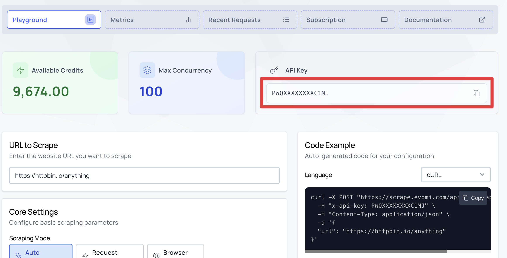
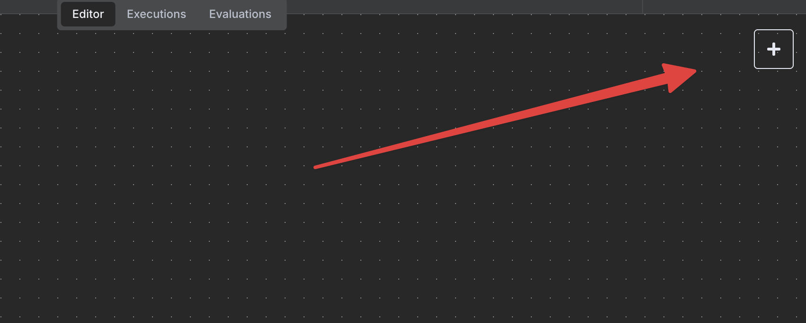
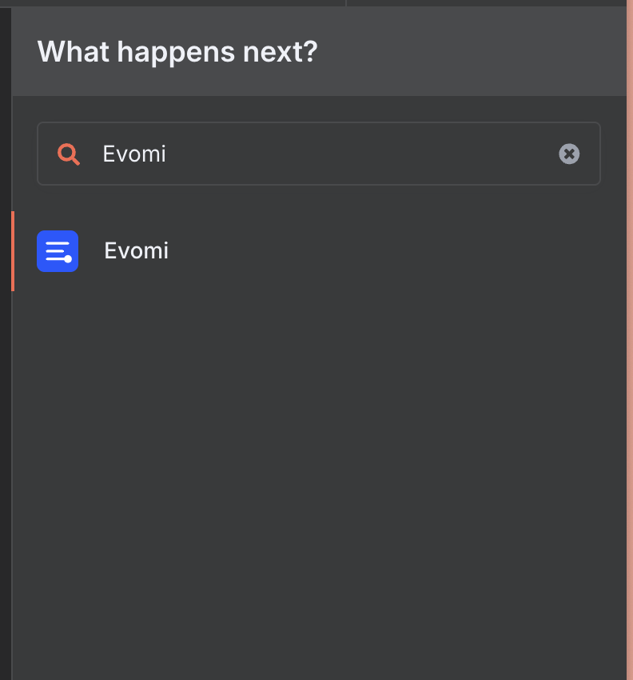
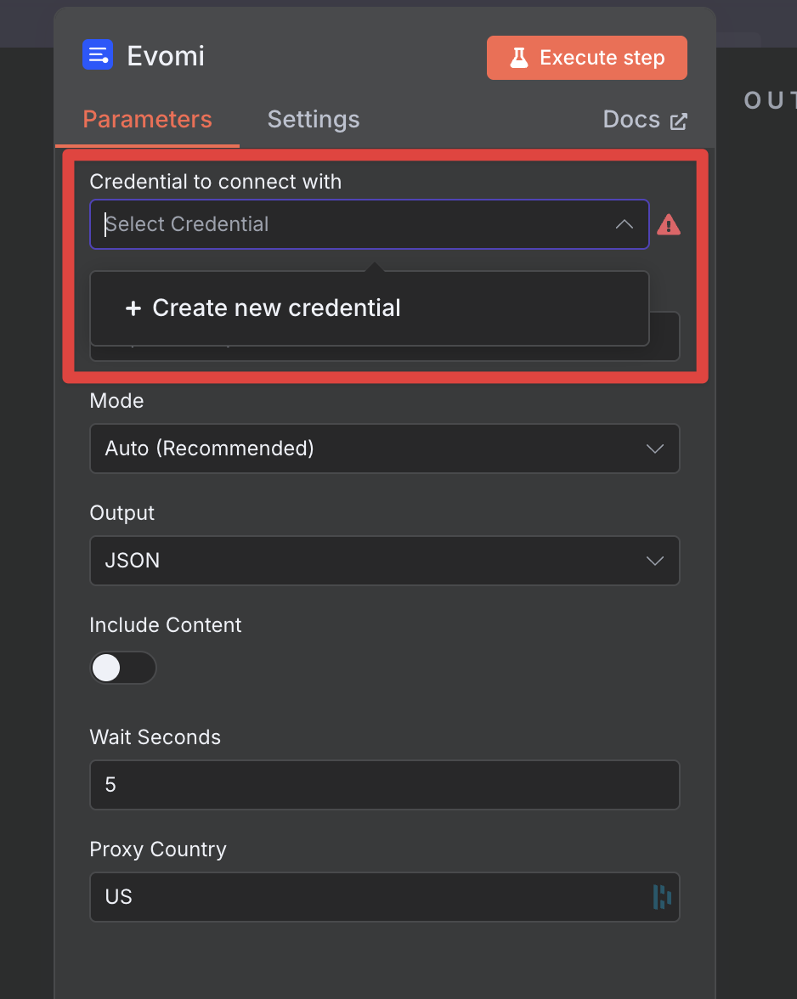
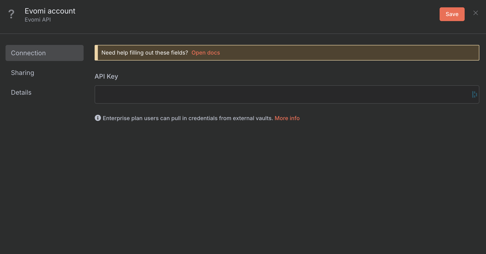
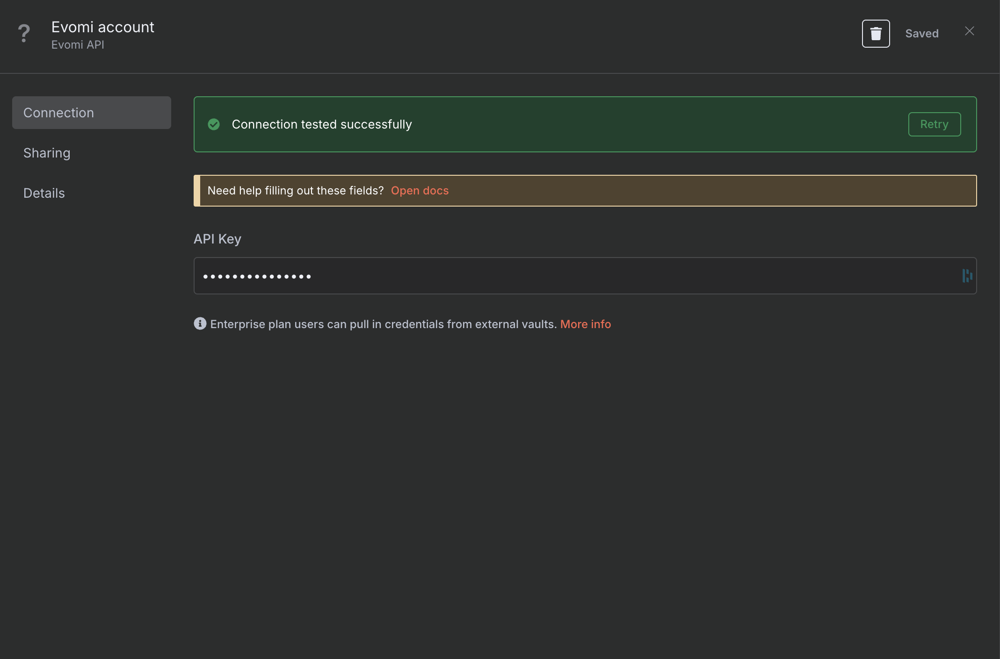
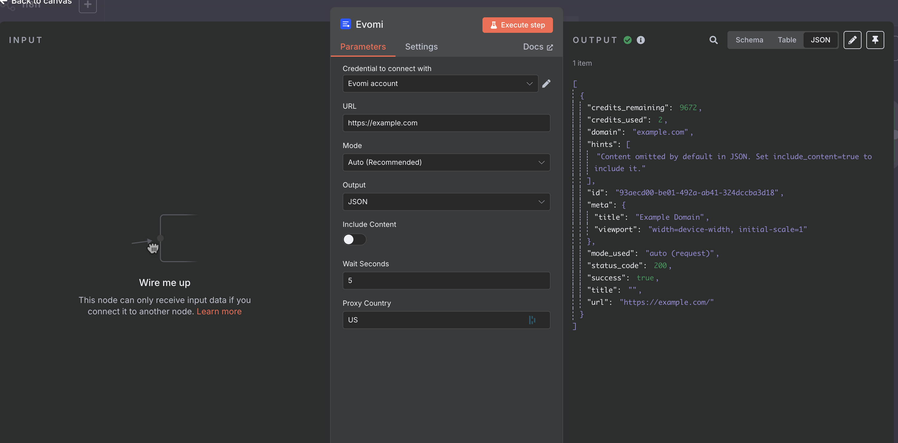

# Evomi n8n Node

This repository provides an n8n community node for **Evomi's Scraper API**, a powerful web scraping tool with intelligent mode detection, automatic CAPTCHA solving, and residential proxy support.

[n8n](https://n8n.io/) is a [fair-code licensed](https://docs.n8n.io/reference/license/) workflow automation platform that lets you connect apps, APIs, and services to build automated workflows.

## Features

- **Intelligent Auto Mode**: Automatically detects whether to use fast HTTP requests or full browser rendering
- **Three Scraping Modes**: Choose between `auto`, `request`, or `browser` modes
- **Multiple Output Formats**: Get results as JSON, Markdown, or Screenshot
- **AI Tool Compatible**: Use as an AI agent tool for intelligent web scraping
- **Automatic CAPTCHA Solving**: Built-in CAPTCHA handling with browser mode
- **Geo-Targeting**: Route requests through proxies in 195+ countries
- **Robust Error Handling**: Comprehensive validation with helpful error messages

---

## Prerequisites

To use this node, you need:

1. **An Evomi account** - Sign up at [evomi.com](https://evomi.com)
2. **Active Scraper API subscription or Pay-As-You-Go credits** - Required to make API requests

> **🎁 Free Trial Available!** New users can get started with a free trial at [my.evomi.com/scraper-api](https://my.evomi.com/scraper-api).

---

## Installation

### From n8n Community Nodes

1. Open your n8n instance
2. Go to **Settings** → **Community Nodes**
3. Select **Install**
4. Enter `n8n-nodes-evomi` and confirm

### Manual Installation

```bash
npm install n8n-nodes-evomi
```

---

## Getting Started

### Step 1: Get Your API Key

1. Log in to your [Evomi Dashboard](https://my.evomi.com)
2. Navigate to **Products** → **Scraper API** → **[Playground](https://my.evomi.com/my/products/scraper-api-universal/playground)**
3. Your API key is displayed in the top-right section of the dashboard



Copy the API key from the highlighted field (click the copy icon next to it).

### Step 2: Add the Evomi Node to Your Workflow

1. In your n8n workflow editor, click the **+** button to add a new node



2. Search for **"Evomi"** in the node selector



3. Click on the **Evomi** node to add it to your workflow

### Step 3: Configure Your Credentials

1. In the Evomi node panel, click on **"Select Credential"** → **"+ Create new credential"**



2. Enter your API key from the Evomi dashboard and click **Save**



3. You should see **"Connection tested successfully"** - your credentials are now saved!



### Step 4: Configure and Execute

1. Enter the URL you want to scrape
2. Choose your preferred mode and output format
3. Click **Execute step** to run the scraper!



---

## Node Parameters

### URL (Required)

The web page URL to scrape. Must include `http://` or `https://`.

```
https://example.com
https://news.ycombinator.com
```

### Mode

Choose how the page should be fetched:

| Mode | Description | Best For | JavaScript |
|------|-------------|----------|------------|
| **Auto** (Default) | Automatically detects the best approach. Tries HTTP first, upgrades to browser if needed. | Most use cases | Auto-detected |
| **Request** | Fast HTTP request without browser rendering. | Static sites, blogs, news, APIs | No |
| **Browser** | Full browser with JavaScript execution. | SPAs, React/Vue/Angular apps, dynamic content | Yes |

### Output

Choose the format for the scraped content:

| Output | Description | Use Case |
|--------|-------------|----------|
| **JSON** (Default) | Structured JSON with metadata. Toggle "Include Content" to get the full HTML. | When you need metadata (title, status, etc.) |
| **Markdown** | Clean, readable text format. | AI processing, content analysis, LLM input |
| **Screenshot** | Full-page PNG image. Automatically enables Browser mode. | Visual verification, archiving, thumbnails |

### Include Content (JSON only)

When using JSON output, toggle this to include the full HTML content in the response. Disable to save bandwidth when you only need metadata.

- **Default**: Off
- **When enabled**: Response includes `content` field with full HTML

### Wait Seconds (Auto & Browser modes)

Seconds to wait after page load before capturing content. Useful for pages that load content dynamically via JavaScript.

- **Default**: 5 seconds
- **Range**: 0-30 seconds
- **Tip**: Increase for slow-loading pages, decrease for fast static sites

### Proxy Country

Route your request through a proxy in a specific country using ISO 3166-1 alpha-2 codes.

- **Default**: US
- **Examples**: `US`, `CA`, `DE`, `GB`, `JP`, `AU`, `FR`, `BR`

**Common Country Codes:**
| Code | Country |
|------|---------|
| US | United States |
| CA | Canada |
| GB | United Kingdom |
| DE | Germany |
| FR | France |
| JP | Japan |
| AU | Australia |
| BR | Brazil |

---

## Usage Examples

### As a Standalone Node

**Basic scraping:**
1. Set URL: `https://example.com`
2. Mode: `Auto`
3. Output: `JSON`
4. Execute

**Get markdown for AI processing:**
1. Set URL: `https://blog.example.com/article`
2. Mode: `Auto`
3. Output: `Markdown`
4. Execute → Feed result to AI node

**Take a screenshot:**
1. Set URL: `https://dashboard.example.com`
2. Mode: `Browser` (auto-selected)
3. Output: `Screenshot`
4. Execute

**Geo-targeted scraping:**
1. Set URL: `https://amazon.de`
2. Proxy Country: `DE`
3. Execute → Get German localized content

### As an AI Agent Tool

Connect the Evomi node to an AI Agent node as a tool. The AI can scrape websites based on natural language prompts.

**Example Prompts:**
- "Scrape https://news.ycombinator.com and summarize the top 5 stories"
- "Get the content from https://example.com/pricing and extract the pricing tiers"
- "Take a screenshot of https://competitor.com/landing-page"

---

## Response Formats

### JSON Output

```json
{
  "success": true,
  "url": "https://example.com",
  "domain": "example.com",
  "title": "Example Domain",
  "status_code": 200,
  "credits_used": 2.0,
  "credits_remaining": 98.0,
  "mode_used": "auto (request)",
  "content": "<html>...</html>"
}
```

### Markdown Output

Returns clean, formatted text:

```markdown
# Example Domain

This domain is for use in illustrative examples in documents...
```

### Screenshot Output

Returns binary PNG image data that can be:
- Saved to file
- Uploaded to cloud storage
- Processed by image nodes

---

## Error Handling

The node provides comprehensive error handling with helpful messages:

### Input Validation Errors

| Error | Cause | Solution |
|-------|-------|----------|
| "URL is required" | Empty URL field | Enter a valid URL |
| "Invalid URL format" | Missing http:// or https:// | Add protocol to URL |
| "Invalid proxy country code" | Not a 2-letter code | Use ISO 3166-1 alpha-2 (e.g., US, DE) |

### API Errors

| Error | Cause | Solution |
|-------|-------|----------|
| "Invalid API key" | Wrong or expired key | Check credentials in n8n |
| "Insufficient credits" | Account out of credits | [Add credits](https://my.evomi.com) or start a [free trial](https://my.evomi.com/scraper-api) |
| "Rate limit exceeded" | Too many requests | Wait and retry, or upgrade plan |
| "Failed to connect" | Network issue | Check internet connection |

### Continue on Fail

Enable **"Continue on Fail"** in node settings to handle errors gracefully. Failed items will return:

```json
{
  "success": false,
  "error": "Error message here",
  "itemIndex": 0
}
```

---

## Credits & Pricing

| Mode | Output | Approximate Cost |
|------|--------|------------------|
| Request | JSON/Markdown | 1-2 credits |
| Auto (request used) | JSON/Markdown | 2 credits |
| Auto (browser used) | JSON/Markdown | 6 credits |
| Browser | JSON/Markdown | 5 credits |
| Browser | Screenshot | 6 credits |

Check your credit balance at [my.evomi.com](https://my.evomi.com).

> **💡 Tip:** Start with a [free trial](https://my.evomi.com/scraper-api) to test the API before committing to a subscription.

---

## Development

### Setup

```bash
# Clone the repository
git clone https://github.com/evomi/n8n-nodes-evomi.git
cd n8n-nodes-evomi

# Install dependencies
npm install

# Build the project
npm run build
```

### Testing Locally

```bash
# 1. Build the node
npm run build

# 2. Link the package
npm link

# 3. Create n8n custom folder and link
mkdir -p ~/.n8n/custom
cd ~/.n8n/custom
npm init -y
npm link n8n-nodes-evomi

# 4. Start n8n
n8n start
```

### Linting

```bash
npm run lint
npm run lint:fix
```

---

## Compatibility

- **Node.js**: >=20.15
- **n8n**: Latest version recommended
- **n8n Nodes API Version**: 1

---

## Resources

- [Evomi Scraper API Documentation](https://docs.evomi.com/scraping-products-instructions/scraper-api/)
- [Evomi Dashboard & API Playground](https://my.evomi.com/my/products/scraper-api-universal/playground)
- [Start Free Trial](https://my.evomi.com/scraper-api)
- [n8n Community Nodes Documentation](https://docs.n8n.io/integrations/community-nodes/)

---

## Support

| Issue Type | Where to Get Help |
|------------|-------------------|
| **This node** | [GitHub Issues](https://github.com/evomi/n8n-nodes-evomi/issues) |
| **Evomi API** | [support@evomi.com](mailto:support@evomi.com) |
| **n8n** | [n8n Community Forum](https://community.n8n.io/) |

---

## License

[MIT](LICENSE.md)
